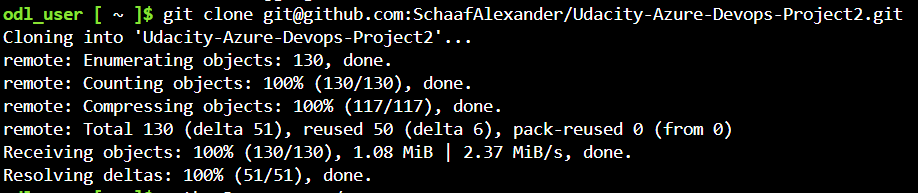

# Overview

[](https://github.com/SchaafAlexander/Udacity-Azure-Devops-Project2/actions/workflows/pythonapp.yml)


In this project, you will build a Github repository from scratch and create a scaffolding that will assist you in performing both Continuous Integration and Continuous Delivery. You'll use Github Actions along with a Makefile, requirements.txt and application code to perform an initial lint, test, and install cycle. Next, you'll integrate this project with Azure Pipelines to enable Continuous Delivery to Azure App Service.

## Project Plan
Keeping track of timelines via Trello and a Google Spreadsheet:

* [Trello](https://trello.com/invite/b/67f24e0d64e6d99e7c25a2bc/ATTI9374d937d54a8dffae2bf323b6a9f9f77CCBF536/udacity-devops-project2)
* [Spreadsheet](https://docs.google.com/spreadsheets/d/1ANMOdretgMMkiOAh9I9MfvVI8GQpek04MBkQ5Y5fP28/edit?usp=sharing)

## Instructions


### 1.1	CI: Set Up Azure Cloud Shell
- Log into your Azure Cloud Shell and create a ssh key gen

```bash
ssh-keygen -t rsa -b 2048 -C "GitHub-Email"
```


Add the public key to your GitHub Account under Settings via the "cat", SSH and GPG keys and give it a name

### 1.2.	Git Clone
- Git clone the project into your Azure Cloud Shell environment
```bash
git clone git@github.com:SchaafAlexander/Udacity-Azure-Devops-Project2.git
```


Create the Python Virtual Environment
```bash
python3 -m venv ~/.myrepo
source ~/.myrepo/bin/activate
```

### 1.3.	Make all test
- Run make all to verify
```bash
make all
```


### 1.4.	Output of a test run
Run the app.py application
```bash
export FLASK_APP=app.py
	flask run
```


Make a prediction with the following code
```bash
sh make_prediction.sh
```


-----

<TODO:  Instructions for running the Python project.  How could a user with no context run this project without asking you for any help.  Include screenshots with explicit steps to create that work. Be sure to at least include the following screenshots:

* Project running on Azure App Service

* Project cloned into Azure Cloud Shell

* Passing tests that are displayed after running the `make all` command from the `Makefile`

* Output of a test run

* Successful deploy of the project in Azure Pipelines.  [Note the official documentation should be referred to and double checked as you setup CI/CD](https://docs.microsoft.com/en-us/azure/devops/pipelines/ecosystems/python-webapp?view=azure-devops).

* Running Azure App Service from Azure Pipelines automatic deployment

* Successful prediction from deployed flask app in Azure Cloud Shell.  [Use this file as a template for the deployed prediction](https://github.com/udacity/nd082-Azure-Cloud-DevOps-Starter-Code/blob/master/C2-AgileDevelopmentwithAzure/project/starter_files/flask-sklearn/make_predict_azure_app.sh).
The output should look similar to this:

```bash
udacity@Azure:~$ ./make_predict_azure_app.sh
Port: 443
{"prediction":[20.35373177134412]}
```

* Output of streamed log files from deployed application

> 

## Enhancements

In this example, we used Azure Pipelines, but in the future one could use GitHub Actions to perform Continuous Delivery.

## Demo 

<TODO: Add link Screencast on YouTube>


