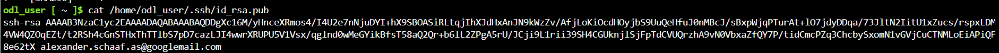

# Overview - For the video

[](https://github.com/SchaafAlexander/Udacity-Azure-Devops-Project2/actions/workflows/pythonapp.yml)


In this project, you will build a Github repository from scratch and create a scaffolding that will assist you in performing both Continuous Integration and Continuous Delivery. You'll use Github Actions along with a Makefile, requirements.txt and application code to perform an initial lint, test, and install cycle. Next, you'll integrate this project with Azure Pipelines to enable Continuous Delivery to Azure App Service.

## Project Plan
Keeping track of timelines via Trello and a Google Spreadsheet:

* [Trello](https://trello.com/invite/b/67f24e0d64e6d99e7c25a2bc/ATTI9374d937d54a8dffae2bf323b6a9f9f77CCBF536/udacity-devops-project2)
* [Spreadsheet](https://docs.google.com/spreadsheets/d/1ANMOdretgMMkiOAh9I9MfvVI8GQpek04MBkQ5Y5fP28/edit?usp=sharing)

## Instructions


### 1.1	CI: Set Up Azure Cloud Shell
- Log into your Azure Cloud Shell and create a ssh key gen

```bash
ssh-keygen -t rsa -b 2048 -C "GitHub-Email"
```


Add the public key to your GitHub Account under Settings via the "cat", SSH and GPG keys and give it a name

### 1.2.	Git Clone
- Git clone the project into your Azure Cloud Shell environment
```bash
git clone git@github.com:SchaafAlexander/Udacity-Azure-Devops-Project2.git
```


Create the Python Virtual Environment
```bash
python3 -m venv ~/.myrepo
source ~/.myrepo/bin/activate
```

### 1.3.	Make all test
- Run make all to verify (cd U.. Tab for folder)
```bash
make all
```


### 1.4.	Output of a test run
Run the app.py application
```bash
export FLASK_APP=app.py
	flask run
```


Make a prediction with the following code (cd U.. Tab for folder)
```bash
sh make_prediction.sh
```


### 3.1 	Deploy application to an Azure App Service
Deploy the application to Azure App Service
```bash
az webapp up -n schaaf-udacity-project2 -g Azuredevops --sku FREE
```


Make a prediction test for deployed app running on Azure App Services
```bash
sh make_predict_azure_app.sh
```


Output of streamed log files from deployed application in Azure App Service 
```bash
az webapp log tail --name schaaf-udacity-project2 --resource-group Azuredevops
```


### 2.1	GitHub Action
CI pipeline using GitHub Actions according to the tasks


Requested Screenshot if GitHub Action Status according to Rubric


### 3.2	Azure Pipelines
Seting up the Azure Pipeline for  CD to Azure App Services we need to follow the provided instructions [Azure pipeline python app instructions](https://docs.microsoft.com/en-us/azure/devops/pipelines/ecosystems/python-webapp?view=azure-devops) and [Azure pipeline self hosted agent](https://learn.microsoft.com/en-us/azure/devops/pipelines/agents/linux-agent?view=azure-devops)


Successful Prediction after CI/CD Deployment


> 

## Enhancements

In this example, we used Azure Pipelines, but in the future one could use GitHub Actions to perform Continuous Delivery.

## Demo 

[YOUTUBE Demo](https://youtu.be/2bwvYN4ZpaM)


